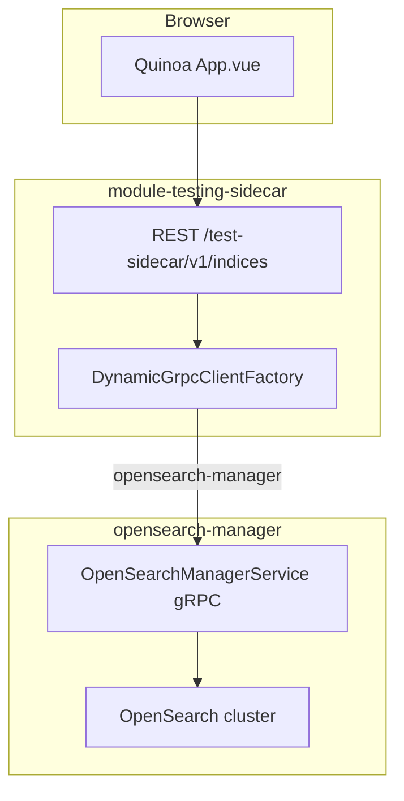

# Index admin: proto, manager, sidecar REST, FE

## Implemented baseline

- **[pipestream-protos](file:///work/core-services/pipestream-protos/opensearch/proto/ai/pipestream/opensearch/v1/opensearch_manager.proto):** `VectorFieldSummary`; `OpenSearchIndexInfo.vector_fields` (field 5); plus existing `GetIndexMapping`, `CreateIndexRequest.vector_field_name`, etc.
- **[opensearch-manager](file:///work/core-services/opensearch-manager):** `OpenSearchIndexingService.listIndices` merges async `_cat/indices` with `VectorSetIndexBindingEntity.findAllByIndexNames`; REST `IndexAdminResource` exposes `vectorFields` in JSON when present. `getIndexMapping` completionStage uses CompletableFuture directly (no erroneous `.toCompletionStage()`); IOException wrapped.
- **[module-testing-sidecar](file:///work/modules/module-testing-sidecar):** **[IndexAdminResource](file:///work/modules/module-testing-sidecar/src/main/java/ai/pipestream/module/pipelineprobe/IndexAdminResource.java)** uses `DynamicGrpcClientFactory` + `MutinyOpenSearchManagerServiceGrpc`; [build.gradle](file:///work/modules/module-testing-sidecar/build.gradle) registers `opensearch` + `schemamanager`, local proto path fallback `../../core-services/pipestream-protos`.

## Architecture

## 1b — VectorFieldSummary (in scope)

- Proto: `VectorFieldSummary` + `repeated vector_fields` on `OpenSearchIndexInfo`.
- Manager: DB join via `VectorSetIndexBindingEntity.findAllByIndexNames` after cat response; summaries from `VectorSetEntity` (id, name, field_name, result_set_name, dimensions).

## Remaining

- **E2E:** Run pipeline + sidecar Index Admin; confirm `vectorFields` appears for indices with bindings.
