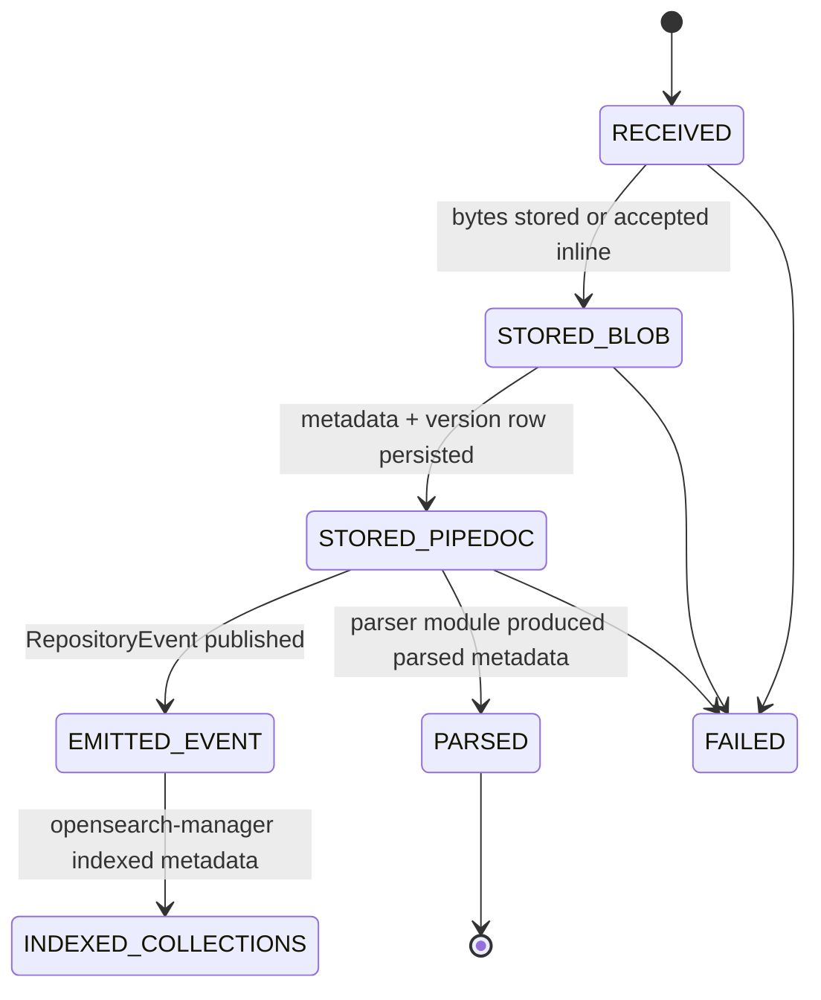
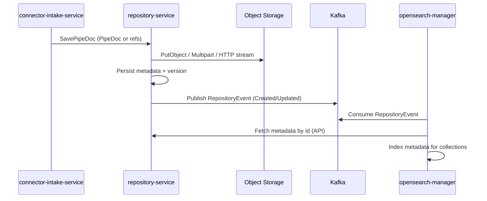

## Repository Service Design

This document captures the **agreed design** for `repository-service`: what it is, why it exists, how it stores data, how uploads work, how hydration/dehydration is enforced, and how Kafka events and indexing fit into the platform.

### Summary
`repository-service` is the platform’s **durable librarian**:
- It is the **source of truth** for uploaded documents and repository metadata.
- It stores **bytes** in S3-compatible object storage (MinIO in dev/test) and stores **metadata + pointers** in the database.
- It emits **Kafka events** on state changes so other services (e.g., `opensearch-manager`) can build indexes without sharing databases.

It is designed to cooperate with:
- **`connector-intake-service`** (gateway/ingress organizer)
- the future **engine** (fast gRPC-to-gRPC processing when durability is optional, durable when Kafka is used)

### Goals
- **Durable repository**: reliable persistence of documents and related metadata.
- **Multiple upload modes**: accept PipeDocs directly, accept streaming/multipart uploads, accept HTTP uploads.
- **Hydration/dehydration correctness**: control when large binary payloads are inline vs stored as references.
- **Event-driven indexing**: Kafka events for downstream indexing/collections.
- **Microservice isolation**: no cross-service shared DB.
- **Security roadmap**: authentication/authorization later; encryption phased in.

### Non-goals (Phase 1)
- Full engine orchestration.
- Final authz policy enforcement across all operations.
- Full client-side encryption end-to-end.

---

## System context and responsibilities

### Actors
- **Customer/Client**: can submit documents (small inline or large raw file).
- **connector-intake-service**: gateway that can normalize uploads and choose the best upload mode.
- **engine (future)**: pipeline orchestrator. Can run fast gRPC hops without persistence; must persist for Kafka hops.
- **parser modules** (e.g., Tika/Docling): parse binary to structured/text and typically allow dropping binary afterwards.

### Authoritative stores
- **Database (repo-service)**: authoritative for repository metadata, identities, version history.
- **S3-compatible object storage**: authoritative for raw bytes (original files and/or protobuf payloads), keyed and versioned.
- **Collections index (OpenSearch, built by opensearch-manager)**: derived index for fast metadata lookup and browsing.

### Why Kafka events
Kafka events are a stable integration surface:
- Many services can subscribe (collections indexing, audit, metrics, downstream triggers).
- Events are *state change notifications*, not a shared database.

---

## Protobuf model (source of record)

### PipeDoc and blob storage references
`PipeDoc` can carry inline bytes or a reference to object storage.

- Inline bytes: `Blob.content = data`
- External storage: `Blob.content = storage_ref (drive_name + object_key + optional version_id)`

This enables the core "claim-check" pattern:
- Large payloads are stored externally; the PipeDoc carries a pointer.
- Small payloads can be inlined for convenience.

### Two-level claim-check: PipeDoc and Blob storage

The claim-check pattern applies at **two levels**:

1. **Blob level**: Raw document bytes (e.g., PDF, image) are stored in S3. The `Blob` within the PipeDoc contains a `storage_ref` pointing to the S3 object.

2. **PipeDoc level**: The serialized PipeDoc protobuf itself is stored in S3, not in the database. The database stores only metadata and S3 references.

**Why store PipeDoc in S3 (not database)?**
- **Security**: Database access should not expose document content. S3 with customer-supplied KMS keys provides better encryption control.
- **Stream not storage**: This is a streaming system. The database tracks and indexes; S3 stores payloads.
- **Customer-supplied S3**: Customers provide their own bucket and KMS key. Storage costs are theirs, not ours.
- **Scalability**: S3 is multi-region and scales automatically. PostgreSQL blob storage is expensive and less scalable.

**Database role**: The `pipedocs` table stores metadata (node_id, doc_id, graph_address_id, cluster_id, account_id, datasource_id, connector_id, object_key, version_id, etag, size, timestamps) for:
- Quick pipeline operations and queries
- Source of truth for document lifecycle tracking
- Enabling OpenSearch to index metadata for fast search

**S3 Path Structure**: Documents are organized hierarchically to group all states of the same logical document together:
- **Intake**: `{prefix}/{account}/{connector}/{datasource}/{docId}/intake/{uuid}.pb`
- **Cluster Processing**: `{prefix}/{account}/{connector}/{datasource}/{docId}/{clusterId}/{uuid}.pb`

This structure enables multi-cluster processing, easy recrawling, and cluster seeding. See [`docs/S3-PATH-STRUCTURE.md`](./docs/S3-PATH-STRUCTURE.md) for detailed documentation.

**Optional persistence**: Documents can flow through the entire pipeline without persistence when using pure gRPC transport (no Kafka edges). Only Kafka edges require `SavePipeDoc` calls, which persist to S3 using the path structure above. The repository service is entirely optional for pure gRPC processing paths.

### Repository service APIs
There are multiple service surfaces in the repo protos. Conceptually they converge on one domain operation: **store bytes and store metadata**.

**Canonical write API (agreed)**
- `PipeDocService.SavePipeDoc` is the canonical “store a document” API.
- `NodeUploadService` is optional/convenience.

**Filesystem metadata API**
- `FilesystemService` stores and queries hierarchical repository metadata (drives, nodes, paths).

**Events**
- `RepositoryEvent` is the core state-change event used for indexing and other subscribers.

---

## Upload modes (3 ways)

We support three upload modes. They should share the same internal conceptual steps:
1) store/confirm bytes (inline or referenced)
2) persist metadata/version information
3) emit events

### 1) Direct PipeDoc insert (first iteration)
**Input**: `PipeDoc` (may include inline bytes or references)

- Easiest end-to-end.
- Supports customers who want “one call” for 2–3MB payloads (and sometimes larger) without forcing a manual 2-step.
- When payload is too large for practical gRPC limits, intake/engine can offload to S3 and send a reference.

### 2) Multi-part streaming upload (bring back)
**Input**: streamed/chunked bytes (binary), then finalize with metadata/PipeDoc reference.

- Used for very large files and for better resilience.
- Implementation should favor correctness and simplicity over complex reactive pipelines.

### 3) HTTP POST upload (most effective for bulk bytes)
**Input**: HTTP stream (raw bytes + Secure Header Metadata auth) → stored to S3 “as-is” with metadata tagged (enough data to make a pipedoc) (optionally encrypted) → receipt

- Good for bulk transfer.
- Lets the client avoid thinking about S3 mechanics.
- Still integrates with the same metadata and event flow.

### Raw-file vs protobuf-file storage
- HTTP uploads store the raw bytes "as-is" (not protobuf).
- Blobs are stored with **UUID-based filenames** (e.g., `{blob-uuid}.bin`) to avoid filename collisions and OS-specific issues.
- The original filename is preserved in `Blob.filename` metadata field.
- The corresponding `PipeDoc` references the raw file via `Blob.storage_ref` pointing to the UUID-named blob file.
- Parser modules can hydrate the raw bytes on demand using the `storage_ref`.

---

## Hydration & dehydration policy (core design)

### Concepts
- **Hydration**: replace `Blob.storage_ref` with inline `Blob.data` when required for a processing step.
- **Dehydration**: replace inline `Blob.data` with `Blob.storage_ref` (and store bytes externally) when required.

### Why policies exist
The platform supports both:
- fast gRPC-to-gRPC processing (durability optional)
- Kafka hops (durability required; must externalize large payloads)

Hydration and dehydration decisions must be consistent and explicit.

### Policy engine
We model “hydration levers” as policies applied per hop/step:
- `ALLOW_INLINE_BLOBS`
- `REQUIRE_S3_REFS`
- `DROP_BLOBS_AFTER_PARSE`
- `KEEP_BLOBS_AS_REF`

Modules can advertise capabilities:
- `requires_binary`
- `requires_parsed_only`
- `can_generate_binary`

### Default engine policy (agreed)
After a parsing step:
- `DROP_INLINE_BLOBS_AFTER_PARSE = true`
- `KEEP_BLOBS_AS_REF = true`

Meaning:
- binary bytes are removed from the document payload for downstream modules
- but the original binary remains retrievable (stored in S3 and referenced)

### Additional use case: binary passed between two parsers without persistence
We also support a special case:
- `parser1 (tika) -> parser2 (docling)`
- binary must remain available between the two parser steps
- we may choose **not** to persist intermediate state, while still retaining the original binary as the payload

This implies a hop-level policy variant:
- `KEEP_INLINE_BLOBS_FOR_NEXT_N_STEPS = 1` (conceptual)
- OR explicitly set `ALLOW_INLINE_BLOBS` for the parser-to-parser hop and only dehydrate after parser2.

---

## Lifecycle state machine

The system tracks a document’s lifecycle through confirmed steps. “Progress” can be implemented as confirmed transitions (not necessarily live byte counters).

Notes:
- Kafka hops require durable state; gRPC-only hops may be ephemeral.
- The repo-service is authoritative for persistence and event emission.

---

## Identity, idempotency, and versioning

### Stable identity
Agreed stable identity for a logical document:
- `(account_id, connector_id, doc_id)` for the logical document
- `(doc_id, graph_address_id, account_id)` for a specific document state (intake or cluster node)

Notes:
- Account is tied to connector; we may also represent `(instance_id, connector_id, account)` as a first-class entity.
- `graph_address_id` is either `datasource_id` (for intake) or `node_id` (for cluster processing)
- `node_id` (UUID primary key) is deterministic: `UUID(doc_id, graph_address_id, account_id)`

### Versions
- `checksum` is the primary content identity for versions.
- With S3 versioning enabled, `s3_version_id` is recorded and emitted; without it, overwrite semantics apply.
- Each graph location state gets its own UUID, allowing multiple versions/states of the same logical document to coexist

### Idempotency rule (agreed direction)
- If `(doc_id, graph_address_id, account_id, checksum)` already exists → idempotent success (return existing node_id)
- If `(doc_id, graph_address_id, account_id)` exists but checksum differs → create a new version and emit an `Updated` event
- Different graph locations (different `graph_address_id`) always create separate records, even for the same `doc_id`

---

## Kafka events and collections indexing

### Event emission
Repo-service emits state-change events (e.g., `RepositoryEvent.Created/Updated/Deleted`).

### Collections index pattern (microservice-safe)
- `opensearch-manager` does **not** share repo-service DB.
- Events should contain enough identifying data to fetch authoritative metadata via API.

Recommended pattern:
1. repo-service writes DB rows (authoritative)
2. repo-service emits event referencing the entity (document id + account/connector + version)
3. indexer consumes event and calls repo-service API to fetch the document metadata to index

This prevents race conditions and keeps a strict microservice boundary.

---

## Authentication and authorization (roadmap)

### Phase 0/1
- Minimal authentication (e.g., API key) is acceptable.
- Propagation mechanisms:
  - gRPC metadata headers
  - Kafka headers
  - HTTP headers

### Future
- Per-account authorization and fine-grained policies.
- Auditing via events.

---

## Encryption (roadmap)

### Phase 1
- Prefer SSE-S3 (or SSE-KMS where available) for operational simplicity.

### Phase 2
- Client-provided key via envelope encryption reference (store key reference, never the raw key).

### Phase 3
- Full client-side streaming encryption if needed.

**Agreed policy**: decryption is available to parsers in early iterations; later we add account-based permission hooks.

---

## Phase plan (implementation order)

### Phase 1 (first milestone)
- Implement `PipeDocService.SavePipeDoc` end-to-end (canonical write path)
- Implement retrieval (`GetPipeDoc`) and “hydrate/dehydrate” behavior for blobs
- Persist metadata in DB + bytes in S3 (or refs)
- Emit `RepositoryEvent` on create/update
- Add one integration test proving: upload → persisted → event emitted → fetch works

### Phase 2
- Multipart/streaming upload
- Confirmed progress updates
- Throughput validation

### Phase 3+
- Collections search enhancements
- Rich authz
- Client-side encryption

---

## Open items
- Concrete DB schema (data dictionary) for:
  - documents
  - versions
  - drives
  - nodes
  - connector/account linkage
- Exact receipt schema (blob receipt vs pipedoc receipt) and how it maps into API responses.
- Default-drive mechanics (creation-time assignment, required at least one).
- Hard limits and routing policies for large payloads across gRPC vs HTTP vs direct-to-S3.

