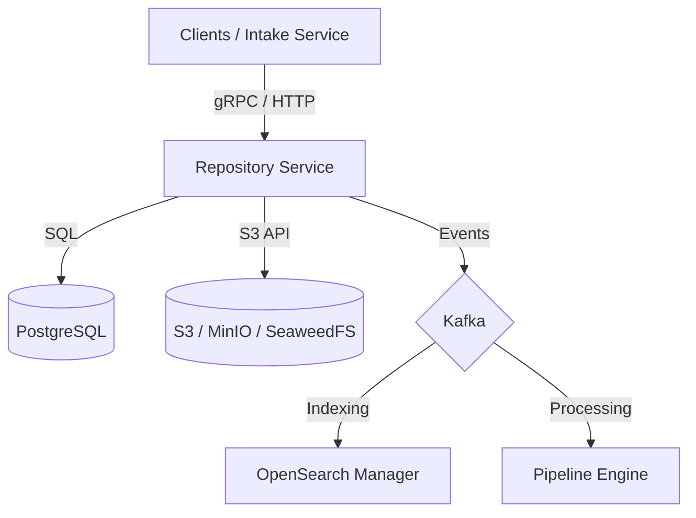

# Repository Service

`repository-service` is the platform's **durable repository** ("librarian") for documents and repository metadata. It provides a centralized, persistent store for logical documents (PipeDocs) and their associated binary blobs, ensuring data durability across the pipeline.

## System Architecture

The service acts as the source of truth for the platform, coordinating between structured metadata in PostgreSQL and unstructured bytes in S3-compatible storage.



## Key Concepts

### 1. Drives (Dynamic S3 Mapping)
A **Drive** is a logical container that maps to a specific S3 bucket and key prefix.
- **Client-Supplied Storage**: Clients can provide their own S3 buckets and credentials by creating a custom Drive.
- **Default Drive**: If no drive is specified, the service falls back to a "default" drive (usually the platform's primary bucket with the `accountId` as a prefix).
- **Isolation**: Drives ensure that data from different accounts or connectors can be physically isolated in different S3 buckets or namespaces.

### 2. Two-Level Claim-Check Pattern
To maintain performance and handle large files efficiently, the service enforces a claim-check pattern at two levels:
- **Blob Level**: Raw binary files (PDFs, images, etc.) are stored in S3. The PipeDoc metadata contains a `storage_ref` pointer.
- **PipeDoc Level**: The serialized PipeDoc protobuf itself is stored in S3. The database only tracks metadata and S3 references to prevent large payload overhead in PostgreSQL.

### 3. Multiple Upload Modes
- **Direct PipeDoc Insert**: Simple gRPC call for PipeDocs with inline or referenced bytes.
- **Multi-part Streaming**: Efficient gRPC streaming for very large files.
- **HTTP POST Upload**: Optimized for bulk data transfer, allowing clients to bypass gRPC overhead for raw bytes.

### 4. Hydration & Dehydration
Automated control over binary data state:
- **Dehydration**: Moving inline bytes to S3 and replacing them with references during persistence.
- **Hydration**: Retrieving S3 bytes and inlining them into the PipeDoc when requested by processing modules.

### 5. Event-Driven Metadata Propagation
State changes (Created, Updated, Deleted) are emitted as Kafka events. This allows downstream services like `opensearch-manager` to build searchable indexes without sharing the core database.

### 6. Deterministic Identity & Idempotency
- Logical identity is based on `(account_id, connector_id, doc_id)`.
- State-specific identity uses `(doc_id, graph_address_id, account_id)`.
- Idempotency ensures that duplicate uploads with the same checksum are handled without redundant storage.

## Getting Started

### Prerequisites
- Java 21+
- Docker (for Quarkus DevServices)

### Run in Dev Mode
Quarkus DevServices will automatically start PostgreSQL, Kafka, and Apicurio Registry. Local development typically uses SeaweedFS or MinIO for S3-compatible storage.

```bash
./gradlew quarkusDev
```

### Running Tests
Tests use LocalStack for S3 and Testcontainers for PostgreSQL to ensure environment parity.

```bash
./gradlew test
```

## Technical Stack
- **Framework**: Quarkus (Reactive)
- **Persistence**: Hibernate Reactive + Panache (PostgreSQL)
- **Object Storage**: AWS SDK v2 (S3-compatible)
- **Messaging**: SmallRye Reactive Messaging (Kafka)
- **APIs**: gRPC (Mutiny) + Jakarta REST
- **Migrations**: Flyway

## Core Configuration

| Property | Description | Default |
|----------|-------------|---------|
| `quarkus.http.port` | HTTP/gRPC Port | `18102` |
| `repo.s3.bucket` | Primary S3 Bucket | `pipestream` |
| `repo.s3.endpoint` | S3 Endpoint Override | `http://localhost:9000` |
| `kafka.bootstrap.servers` | Kafka Brokers | `localhost:9092` |

---
*For detailed design decisions and S3 path conventions, see [DESIGN.md](./DESIGN.md) and [docs/S3-PATH-STRUCTURE.md](./docs/S3-PATH-STRUCTURE.md).*
