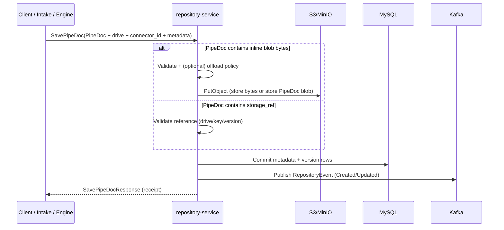
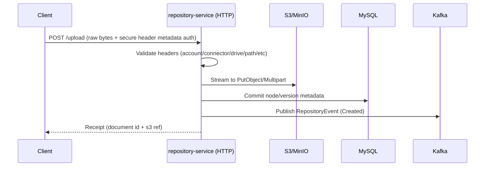

## Upload Flows (Updated)

This document is aligned with the consolidated design in [`../../DESIGN.md`](../../DESIGN.md).

The platform supports **three upload modes**. All three converge on the same internal lifecycle:
1) store/confirm bytes (inline or S3)
2) persist authoritative metadata/version rows
3) publish a lean Kafka state-change event

---

## Mode 1: Direct PipeDoc insert (canonical API)

**Canonical write API**: `PipeDocService.SavePipeDoc`

### High-level sequence

### Notes
- Inline bytes are allowed for convenience.
- If the payload is too large for practical transport, intake/engine can offload to S3 and send a reference.

---

## Mode 2: Multipart / streaming upload (bulk bytes)

This mode exists for very large files.

### Conceptual steps
1. Begin upload session → obtain receipt
2. Upload bytes in parts (streaming)
3. Complete upload → repo-service stores metadata and emits event

### Key design points
- Correctness-first: retries, idempotency, cleanup of abandoned uploads.
- A coordination layer may be used as an implementation detail (prefer DB-backed coordination).

---

## Mode 3: HTTP POST streaming upload (raw bytes)

HTTP POST is the most direct bulk-ingest path.

### High-level sequence

### Notes
- Bytes are stored “as-is” (not protobuf).
- The PipeDoc references the stored bytes via `Blob.storage_ref`.

---

## Hydration/dehydration hooks (engine + repo-service)

### Default policy after parsing
- Drop inline binary bytes after parsing
- Keep references so the original binary remains retrievable

### Special case: parser → parser
- Allow binary to remain inline between two parsers (e.g., Tika → Docling)
- Dehydrate after the second parser step

---

## Progress updates
Progress can be implemented as **confirmed state transitions** (rather than live byte counters) initially:
- RECEIVED → STORED_BLOB → STORED_PIPEDOC → EMITTED_EVENT → INDEXED_COLLECTIONS

This keeps complexity manageable while still being useful.
