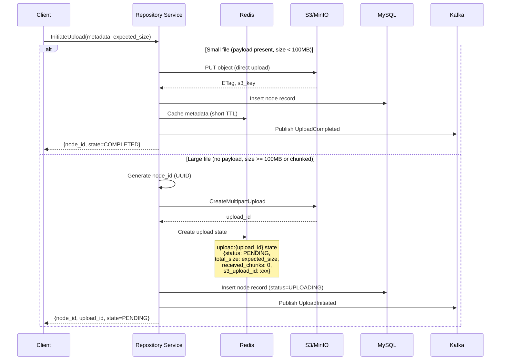
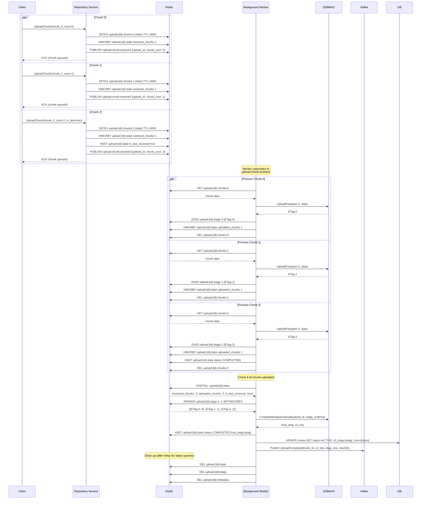

# Upload Flow - Detailed Design

## Overview

The upload flow is split into two distinct phases to enable fast client responses and parallel chunk uploads.

## Phase 1: Upload Initiation (Blocking Call)

### API Call

```protobuf
message InitiateUploadRequest {
  string drive = 1;                    // Drive name (e.g., "documents")
  string parent_id = 2;                 // Parent folder UUID (empty for root)
  string name = 3;                      // File name
  map<string,string> metadata = 4;      // Custom metadata
  int64 expected_size = 5;              // Total file size in bytes
  string mime_type = 6;                 // MIME type
  string connector_id = 7;              // Connector identifier
  bytes payload = 8;                    // For small files (< 100MB) - immediate upload
  string client_node_id = 9;            // Optional: client-provided stable ID
  bool fail_if_exists = 10;             // Optional: prevent overwrites
  string path = 11;                     // Optional: relative path (e.g., "docs/2024/")
}

message InitiateUploadResponse {
  string node_id = 1;                   // Document UUID
  string upload_id = 2;                 // Upload tracking ID
  UploadState state = 3;                // PENDING or COMPLETED (if small file)
  int64 created_at_epoch_ms = 4;        // Creation timestamp
  bool is_update = 5;                   // true if overwrites existing
  string previous_version_id = 6;       // S3 version ID if updating
}
```

### Server-Side Processing



### Redis State Initialization

When initiating a large file upload, the following Redis keys are created:

```redis
# Upload state hash
HSET upload:{upload_id}:state \
  node_id {node_id} \
  s3_upload_id {s3_upload_id} \
  s3_key {s3_key} \
  drive {drive_name} \
  status PENDING \
  expected_size {bytes} \
  received_chunks 0 \
  uploaded_chunks 0 \
  created_at {timestamp} \
  mime_type {mime_type}

EXPIRE upload:{upload_id}:state 86400  # 24 hour TTL

# Metadata for final completion
HSET upload:{upload_id}:metadata \
  name {filename} \
  connector_id {connector_id} \
  parent_id {parent_id}

EXPIRE upload:{upload_id}:metadata 86400

# Initialize empty sorted set for ETags (ordered by chunk number)
# This will be populated as chunks complete
ZADD upload:{upload_id}:etags
EXPIRE upload:{upload_id}:etags 86400
```

## Phase 2: Parallel Chunk Upload (Non-Blocking)

### API Call (Unary - Enables True Parallelism)

```protobuf
message UploadChunkRequest {
  string node_id = 1;          // From Phase 1 response
  string upload_id = 2;        // From Phase 1 response
  bytes data = 3;              // Chunk data (5MB - 100MB recommended)
  int64 chunk_number = 4;      // 0-based chunk index
  bool is_last = 5;            // Mark final chunk
}

message UploadChunkResponse {
  string node_id = 1;
  UploadState state = 2;             // UPLOADING or COMPLETED
  int64 bytes_uploaded = 3;          // Total bytes uploaded so far
  int64 chunk_number = 4;            // Echo chunk number
  string file_sha = 5;               // File hash when complete
  HashType hash_type = 6;            // SHA256_BASE64
  string job_id = 7;                 // S3 job ID for tracking
  bool is_file_complete = 8;         // true when all chunks uploaded
}
```

### Chunk Upload Sequence



### Key Design Decisions

#### 1. Why Unary UploadChunk (not bidirectional streaming)?

**Rationale:**
- Unary calls allow true client-side parallelism
- Client can fire 10+ parallel requests without coordinating streams
- gRPC handles parallelism better with multiple unary calls than single bidirectional stream
- Simpler error handling (retry individual chunks, not entire stream)

#### 2. Why Redis pub/sub for worker coordination?

**Rationale:**
- Workers subscribe to `upload:chunk:received` channel
- When chunk arrives, Redis publishes notification
- Multiple workers can compete to process chunks (first to GET wins)
- Decouples chunk ingestion from S3 upload

#### 3. Why TTL on chunk data?

**Rationale:**
- Chunks are temporary (deleted after S3 upload)
- TTL prevents Redis memory leak if worker crashes
- 1 hour TTL is enough for retry logic
- Upload state has 24 hour TTL for status queries

## Progress Tracking

### Polling (GetUploadStatus)

```protobuf
rpc GetUploadStatus(GetUploadStatusRequest) returns (GetUploadStatusResponse);

message GetUploadStatusRequest {
  string node_id = 1;
}

message GetUploadStatusResponse {
  string node_id = 1;
  UploadState state = 2;           // PENDING, UPLOADING, COMPLETED, FAILED
  int64 bytes_uploaded = 3;
  int64 total_bytes = 4;
  string error_message = 5;
  int64 updated_at_epoch_ms = 6;
}
```

**Implementation:**
```redis
HGETALL upload:{upload_id}:state
# Returns current status, chunk counts, etc.
```

### Streaming (StreamUploadProgress)

```protobuf
rpc StreamUploadProgress(UploadProgressRequest) returns (stream UploadProgressResponse);
```

**Implementation:**
- Subscribe to Redis pub/sub channel: `upload:progress:{upload_id}`
- Workers publish progress updates after each chunk
- Server streams updates to client in real-time

```redis
SUBSCRIBE upload:progress:{upload_id}

# Worker publishes after each chunk upload
PUBLISH upload:progress:{upload_id} '{"uploaded_chunks": 5, "total_chunks": 10, "percent": 50.0}'
```

## Error Handling

### Chunk Upload Failures

1. **Network error during chunk upload:**
   - Client receives error response
   - Client retries same chunk (idempotent by chunk_number)
   - Redis tracks received chunks, prevents duplicates

2. **S3 part upload failure:**
   - Worker retries with exponential backoff (3 attempts)
   - If all retries fail: HSET status FAILED, publish UploadFailed event
   - Client queries status, sees FAILED, can restart entire upload

3. **Missing chunks:**
   - Client marks is_last=true on final chunk
   - Worker waits for all chunk numbers 0..N
   - After timeout (10 min), mark upload FAILED if chunks missing

4. **Upload timeout:**
   - If no chunk received for 30 minutes, mark upload EXPIRED
   - Client must restart with new InitiateUpload

### Recovery Scenarios

| Scenario | Detection | Recovery |
|----------|-----------|----------|
| Service restart mid-upload | Redis state persists | Background worker resumes processing queued chunks |
| S3 temporary unavailability | Upload part fails | Worker retries with backoff, eventually fails upload |
| Client disconnect | No new chunks for 30 min | Upload marked EXPIRED, cleanup after 24 hours |
| Duplicate chunk | chunk_number already in etags | Idempotent: ignore duplicate, return ACK |
| Out-of-order chunks | Worker processes as received | ETags stored in sorted set, ordered before completion |

## Performance Characteristics

### Single Large File (1GB, 10 chunks × 100MB)

```
Phase 1: InitiateUpload
  - Response time: < 100ms (generate IDs, create Redis keys, initiate S3 multipart)

Phase 2: Upload 10 chunks in parallel
  - Each chunk:
    - Client→Server: ~10 seconds (100MB over gigabit)
    - Server response: < 50ms (queue in Redis, ACK)
  - Total client time: ~10 seconds (limited by network, not server)

Background processing:
  - Each chunk S3 upload: ~5 seconds (Redis→S3)
  - Parallel workers: 10 chunks in ~5-10 seconds total
  - S3 CompleteMultipartUpload: < 1 second

Total time: ~15-20 seconds (vs 30+ seconds sequential)
```

### Throughput

- **Chunk ingestion**: 1000+ chunks/sec per service instance (Redis bottleneck ~10K ops/sec)
- **S3 upload workers**: Limited by S3 bandwidth and parallelism
- **Scalability**: Horizontal scaling by adding service instances + Redis cluster

## Next: Redis Queuing Design

See [02-redis-queuing.md](02-redis-queuing.md) for detailed Redis data structures and queuing patterns.
